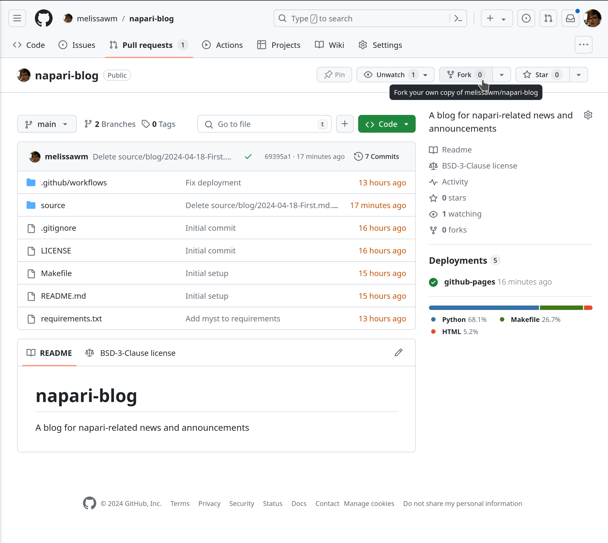
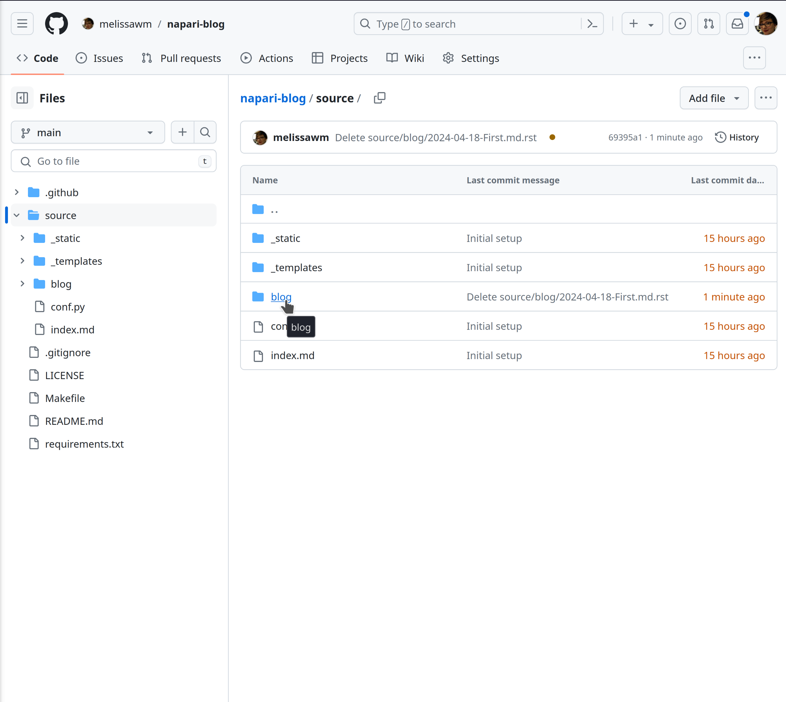
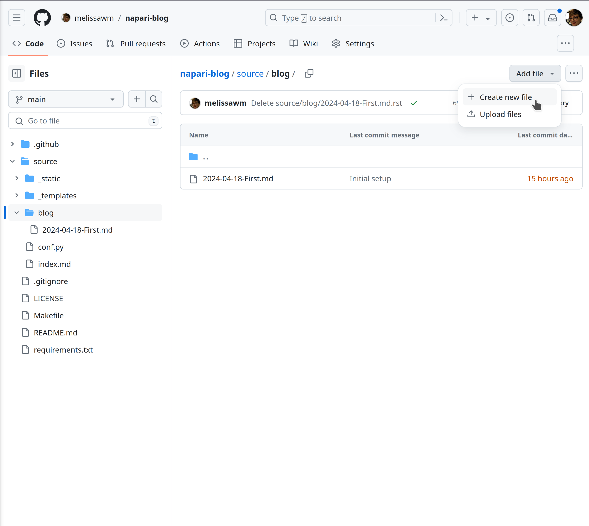
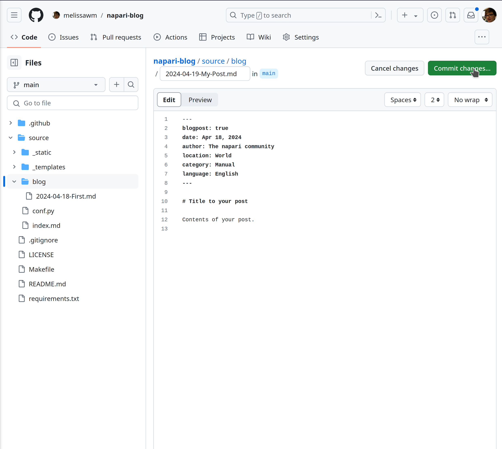
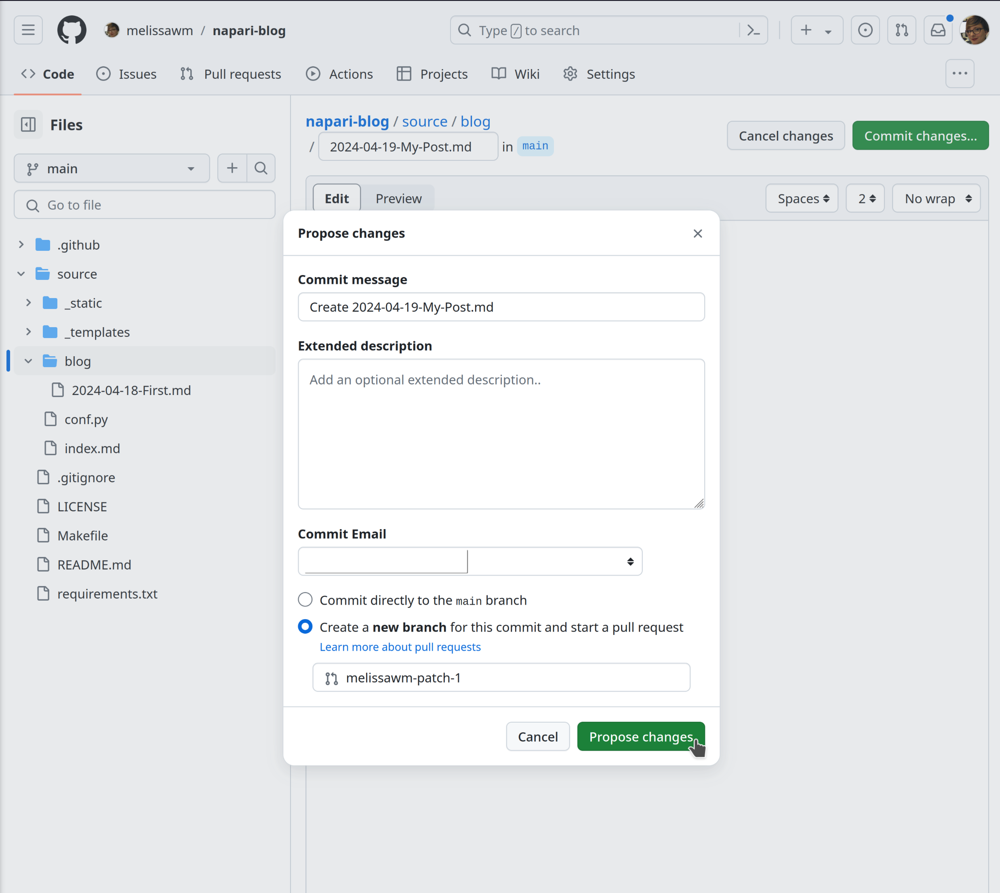
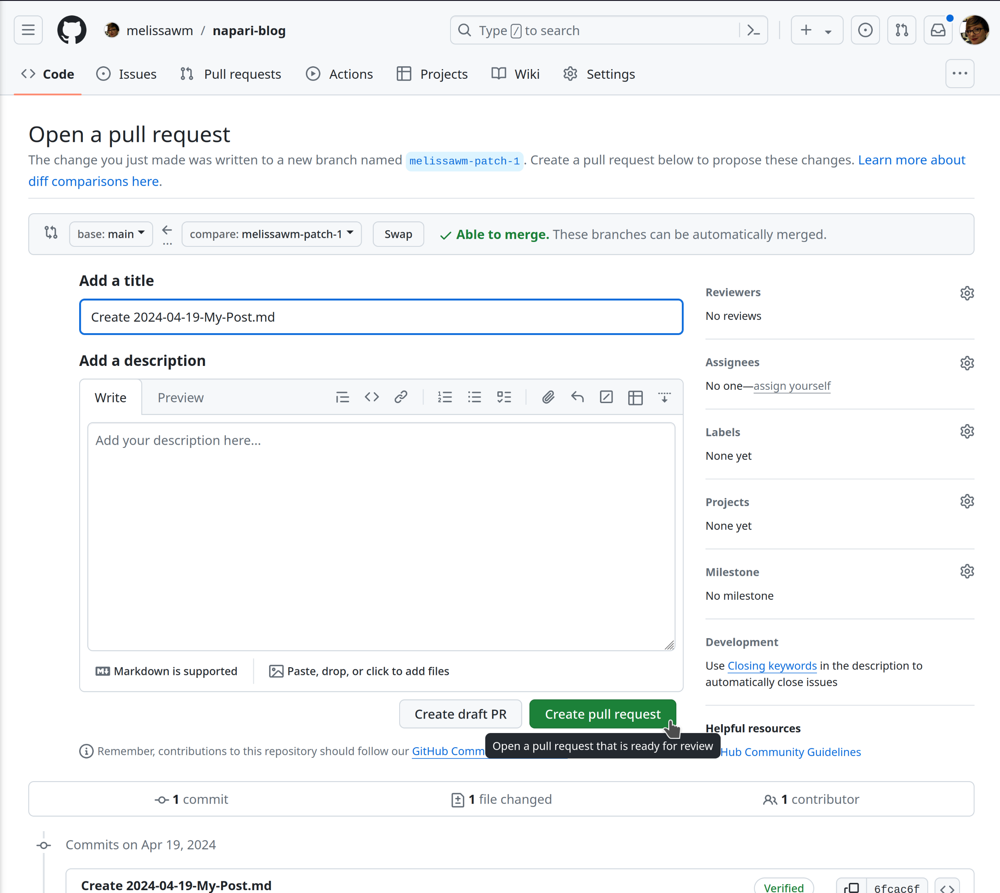
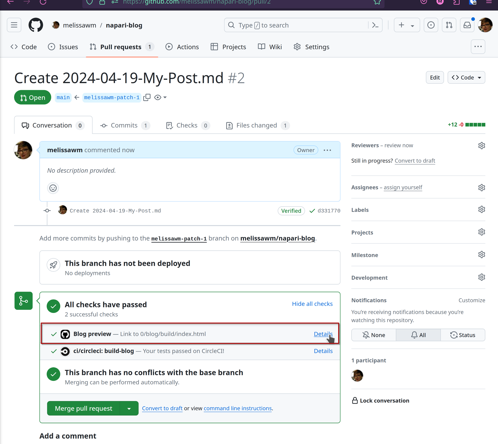

# The Island Dispatch 🏝️

A blog for napari-related news and announcements.

To contribute a post, please submit a pull request to this repository with your post written in markdown format.

If you need help, join us on [Zulip](https://napari.zulipchat.com)! 

## How to submit a post

If you are familiar with the GitHub workflow, you can submit a post directly via pull request. If you prefer using the GitHub web interface, follow the steps below:

1. Fork this repository



1. On your fork, navigate to [`source/blog`](source/blog) and create a new markdown file.





2. Your post must have the following front-matter (with date, author, location, category, and language fields filled in according to your post):

```markdown
---
blogpost: true
date: Apr 18, 2024
author: The napari community
location: World
category: Manual
language: English
---

# Title to your post

Contents of your post.
```

3. Name your file and commit your changes.



4. Submit your changes as a Pull Request.

> [!IMPORTANT]
> Make sure you select "Create a new branch for this commit and start a pull request".



5. You will have the option to add more context or information to your Pull Request proposal, and submit it. If you are still working on your post, you can create a "Draft Pull Request" to save your progress. Once you are ready, you can  mark it as "Ready for review" to notify the maintainers.



6. Wait for a review 🎉

Once your post is approved, it will be published on the blog.

## Local Development

The blog is built with [Sphinx](https://www.sphinx-doc.org/) and [ABlog](https://ablog.readthedocs.io/),
and dependencies are managed with [uv](https://docs.astral.sh/uv/).

Install uv once (see the [uv installation instructions](https://docs.astral.sh/uv/getting-started/installation/)),
then everything else is a single command:

```bash
# One-time build into build/ (uv creates/updates the environment for you) -W errors on warnings
uv run sphinx-build source build -W

# Live reload for development (serves from its own scratch dir, build/live)
uv run sphinx-autobuild source build
```

### Live development

The `sphinx-autobuild` command will:
- Watch for file changes in the `source` directory
- Automatically rebuild when files change
- Serve the site locally (usually at http://127.0.0.1:8000)
- Auto-refresh your browser when changes are detected

### Project structure

- `source/` - Source files for the blog
- `source/blog/` - Individual blog posts
- `source/_static/` - Static assets (images, videos, etc.)
- `build/` - Generated site
- `pyproject.toml` - Python dependencies
- `uv.lock` - Pinned dependency versions

## Review process

When your pull request is submitted, a few checks will run automatically to validate the post syntax and metadata. You can see a preview of your post by clicking on the "Blog preview" link in the Checks section of the Pull Request page.


