# hackathon recap: naPLari in Krakow, Poland in July 2026

On May 21, we [announced][naplari-announce] our second public hackathon, timed
to coincide with EuroSciPy 2026 in Krakow, Poland. Six core team members and
seven community members answered the call, and two months ago, we
wrapped up one of the most productive weeks in napari development history! You
can enjoy the fruits of our labor in [napari 0.9.0][0.9-relnotes], but do read
on for a blow-by-blow, and, if it sounds appealing — we'd love to have you in
the next one! — be sure to follow our updates on [BlueSky][bsky],
[Mastodon][masto], [LinkedIn][linkedin], or on our [Zulip chat][zulip]!

[naplari-announce]: https://napari.zulipchat.com/#narrow/channel/212875-general/topic/naPLari.20hackathon.20.E2.80.94.20Krak.C3.B3w.2C.20Poland.20July.2024-29.2C.202026/near/596628071
[0.9-relnotes]: https://napari.org/stable/release/release_0_9_0.html
[bsky]: https://bsky.app/profile/napari.org
[masto]: https://fosstodon.org/@napari
[linkedin]: https://www.linkedin.com/company/napari
[zulip]: https://napari.zulipchat.com

## Setting the stage

naPLari comes hot on the heels of our successful [GloBIAS hackathon] in October
2025, and included two repeat community participants, Aroj and Zuzana. (See
below for some individual perspectives!) After GloBIAS, we knew we wanted to
keep running these: they are a great way to focus energy, get a lot done in a
short amount of time, and foster the community spirit that napari has become
known for.

[GloBIAS hackathon]: https://www.globias.org/activities/past-activties/bioimage-analysis-conference-2025-in-kobe#h.5n67k4il9zt

We knew a few people from the core team would be at EuroSciPy, so dovetailing
on that conference might be a great way to save on travel — and environmental —
costs. Thanks to long-time contributor and napari Developer-in-Residence
Grzegorz Bokota, who led the conversations with the EuroSciPy organisers, we
were able to find a great hackathon space in the [AGH Faculty of Physics &
Applied Computer Science][agh] buildings!

[agh]: https://www.fis.agh.edu.pl/en/faculty

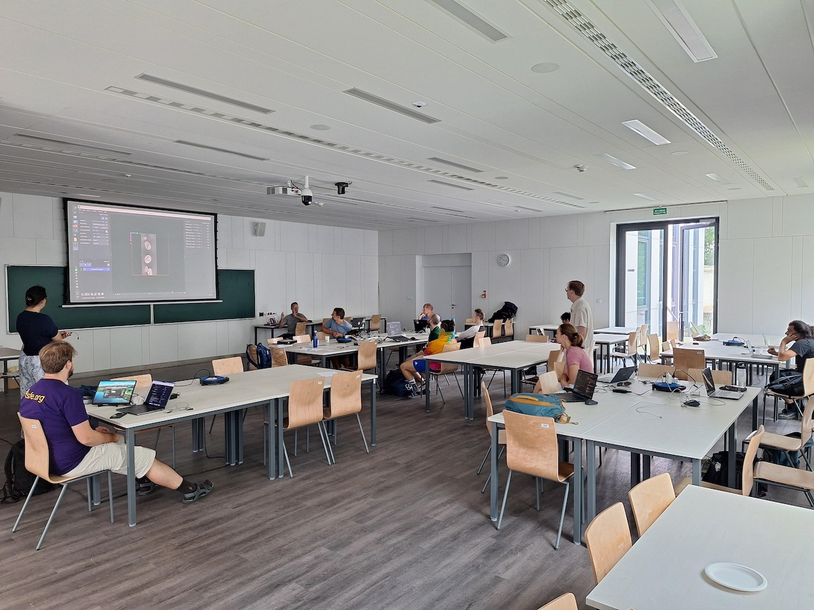

## Working together

Writing code is often a solitary endeavour, particularly these days where
remote work is common. And open source has a (good!) culture of asynchronous
work, where one person writes code, submits it for review, and waits for
someone else, often on the other side of the globe, to help improve it. Great
things have been built with this model, and it has major advantages! But
ultimately, you can't beat the high bandwidth communication of being in the
same room, both for technical discussion and for a sense of fun and camaraderie
that you just can't get on Zoom.

````{grid} 2
:gutter: 2

```{grid-item}
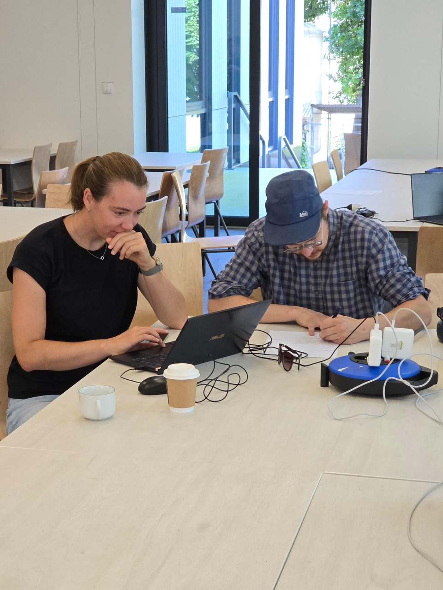
```

```{grid-item}
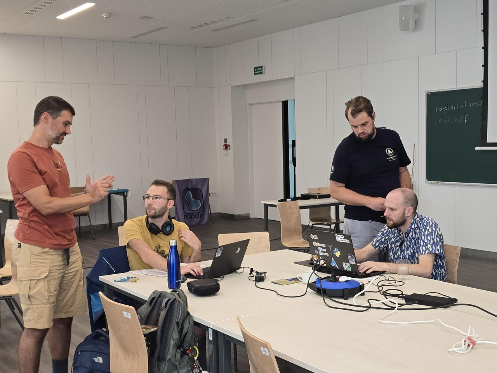
```

```{grid-item}
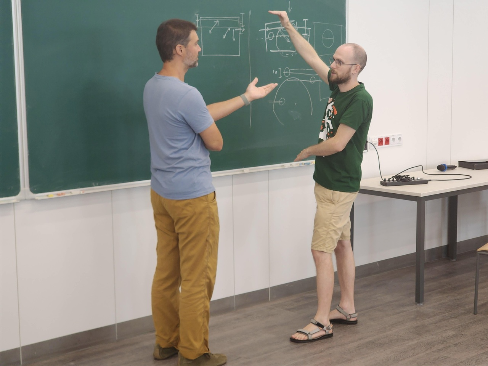
```

```{grid-item}
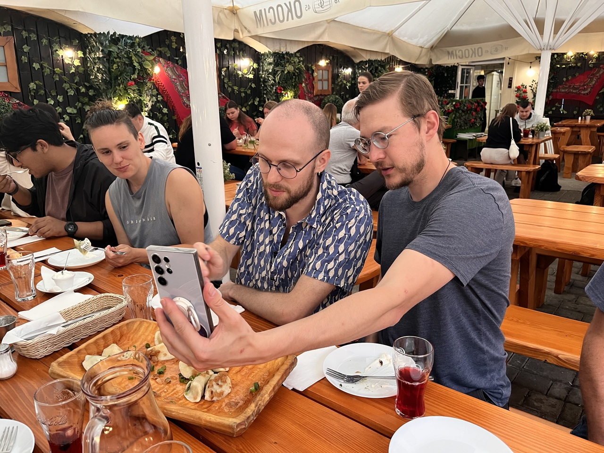
```
````

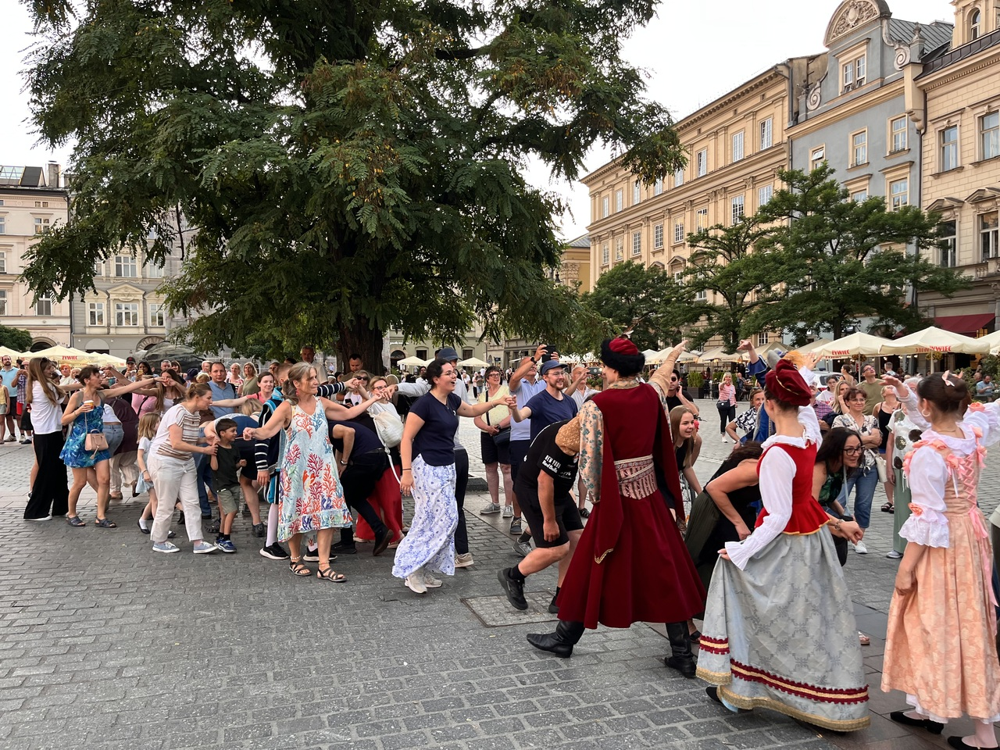

At the hackathon, we each had our own focus areas, but for each focus area, we
had one or two "buddies" with whom we could always check in. This makes for
rapid progress: it helps with decision paralysis, talking through thorny
problems, and sharing expertise, among others. Typically, each buddy group had
at least one member of the core team and one external participant.

We also did morning check-ins daily to catch people up on what we'd worked on
the previous day, and plan for any group discussions needed to iron out some of
the tougher challenges!

## Feature highlights

So what good was it? Here's some of the stuff we got done.

### Auto-labelling of viewer axes

Zuzana Čočková and I started making napari more faithful to layer metadata,
with axis labels on layers being correctly displayed on the viewer for the
first time. This is really important because [reader plugins] don't have access
to the viewer, so they couldn't set the axis labels, even if they could
correctly read them from the source file. Now, if a reader sets the axis labels
on a layer, the viewer respects and displays them!

[reader plugins]: https://napari.org/stable/plugins/building_a_plugin/guides.html#readers


```{raw} html
<figure>
  <video width="100%" controls autoplay loop muted playsinline>
    <source src="../_static/auto-labeled-axes.webm" type="video/webm">
    <source src="../_static/auto-labeled-axes.mp4" type="video/mp4">
    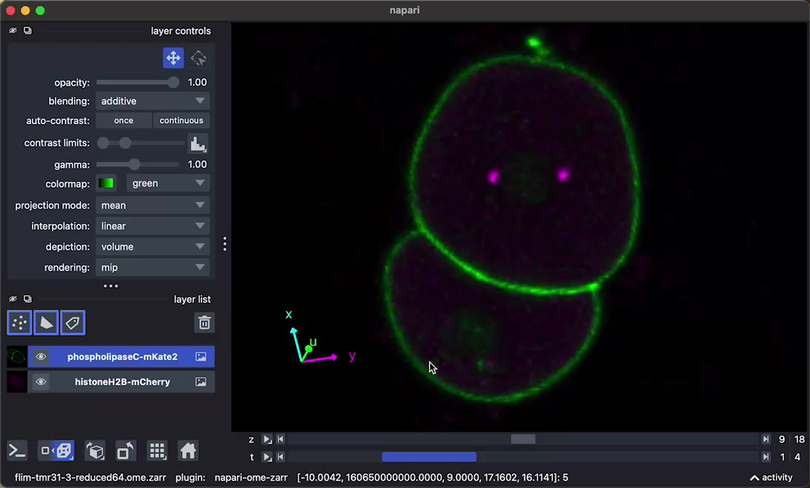
  </video>
  <caption>
    <p>napari displaying a 5-dimensional multichannel array, with all axes
    correctly labeled.</p>
  </caption>
</figure>
```

### Automagic reading of Xarray metadata

Tim Monko was then able to build on that work and close napari issue [#14]!!!
That's not a typo, one-four! This is a brilliant continuation of the
napari+xarray work Tim and Ian Hunt-Isaak [kickstarted] at the SciPy 2025
conference.

[#14]: https://github.com/napari/napari/issues/14
[kickstarted]: ./napari-xarray.md

```{raw} html
<figure>
  <video width="100%" controls autoplay loop muted playsinline>
    <source src="../_static/xarray-auto-label.webm" type="video/webm">
    <source src="../_static/xarray-auto-label.mp4" type="video/mp4">
    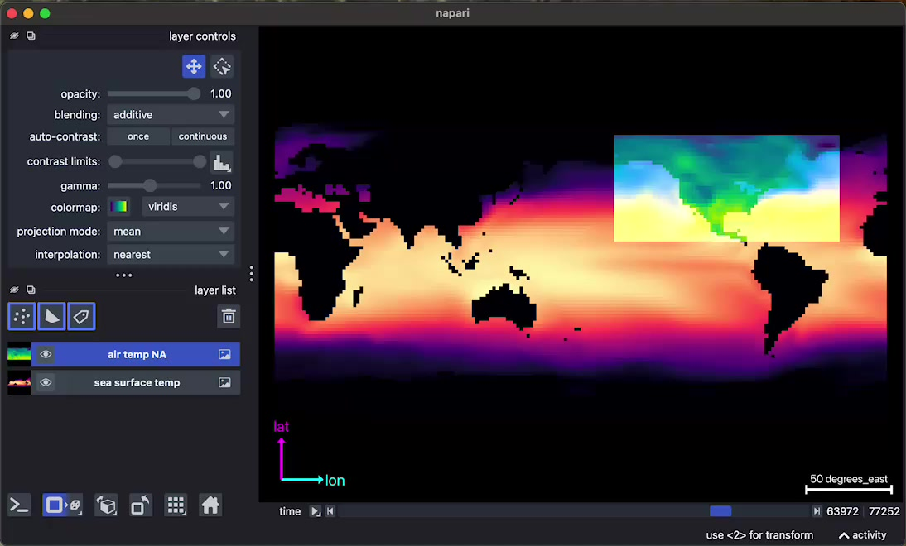
  </video>
  <caption>
    <p>napari displaying an xarray-based climate dataset with correctly labeled axes and units.</p>
  </caption>
</figure>
```

### Plugin settings

Ever since the dawn of plugins, plugin authors have wanted to persist user
preferences to disk. Of course, this is Python, anyone can make something that
works. But, at the hackathon, Giannis Liaskas and Draga Doncila Pop built on
earlier work by Talley Lambert and Nathan Clack to create a spot for plugins to
declare preference settings *and* an automatically generated UI panel for users
to set the preferences within napari. Try it out!

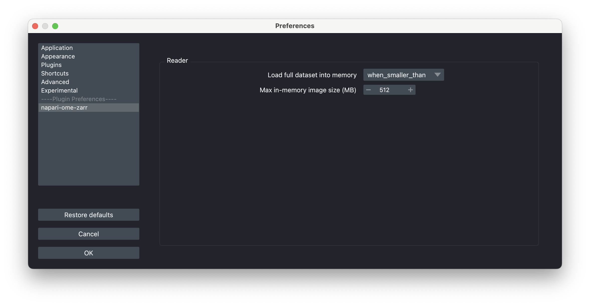

### Coming soon: slicing with non-orthogonal transformations!

If you ever tried to look at 3+D data with any kind of out-of-plane rotations
or other transformations, you'll know that napari just ignores the out-of-plane
component. That will be a thing of the past once Jules Vanaret's
[non-orthogonal transformations PR] is merged!

[non-orthogonal transformations PR]: https://github.com/napari/napari/pull/9337

This will be incredibly, *cough*, transformative, *cough* for viewing lattice
light sheet data, for example, which is displayed skewed in napari in 2D, or
for 3D registration data, as displayed by [OME-Zarr 0.6] datasets.

```{raw} html
<figure>

<table>
  <tr>
    <td align="center">
      <video width="100%" controls autoplay loop muted playsinline>
        <source src="../_static/non-ortho-before.webm" type="video/webm">
        <source src="../_static/non-ortho-before.mp4" type="video/mp4">
        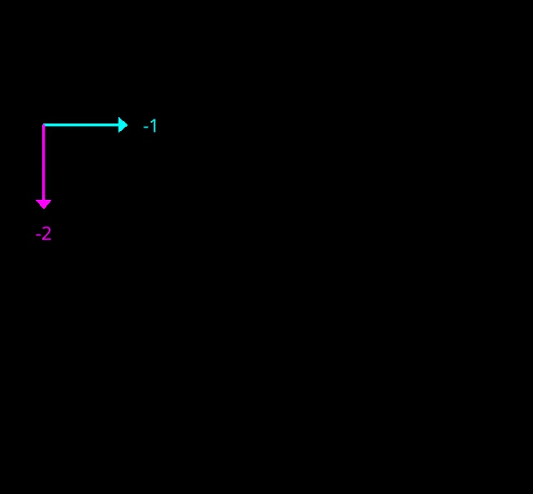
      </video>
      <br>
      <b>Before <a href="https://github.com/napari/napari/pull/9337">#9337</a></b>
    </td>
    <td align="center">
      <video width="100%" controls autoplay loop muted playsinline>
        <source src="../_static/non-ortho-after.webm" type="video/webm">
        <source src="../_static/non-ortho-after.mp4" type="video/mp4">
        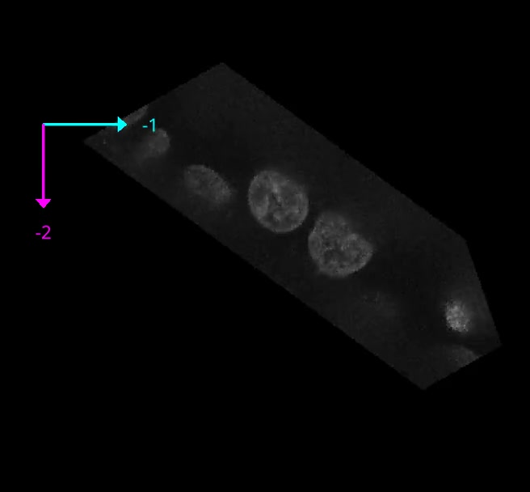
      </video>
      <br>
      <b>After <a href="https://github.com/napari/napari/pull/9337">#9337</a></b>
    </td>
  </tr>
</table>

<caption>
<p>Before and after comparison of slicing a volume with a non-orthogonal
transformation in napari. (That is, a transformation that is not completely
contained within the slicing plane.)</p>
</caption>

</figure>
```

[#9337]: https://github.com/napari/napari/pull/9337
[OME-Zarr 0.6]: https://bsky.app/profile/jo-soltwedel.bsky.social/post/3mw6mdn5rpc2v

### Auto-generated layer controls

Margot Chazotte, like many others before her, was annoyed at having to change
some layer settings, such as contrast limits, separately on each individual
layer. With Lorenzo Gaifas's help, she developed a system that builds the layer
controls dynamically when one or multiple layers are selected, based on their
common attributes. You can now change the contrast limits on many layers at
once, for example! Or make several layers invisible/visible/translucent.

We didn't have much time for testing and refining, so it's labelled as
experimental for now, but you can use it today and it will be the default
shortly!

```{raw} html
<figure>
  <video width="100%" controls autoplay loop muted playsinline>
    <source src="../_static/multi-layer-controls.webm" type="video/webm">
    <source src="../_static/multi-layer-controls.mp4" type="video/mp4">
    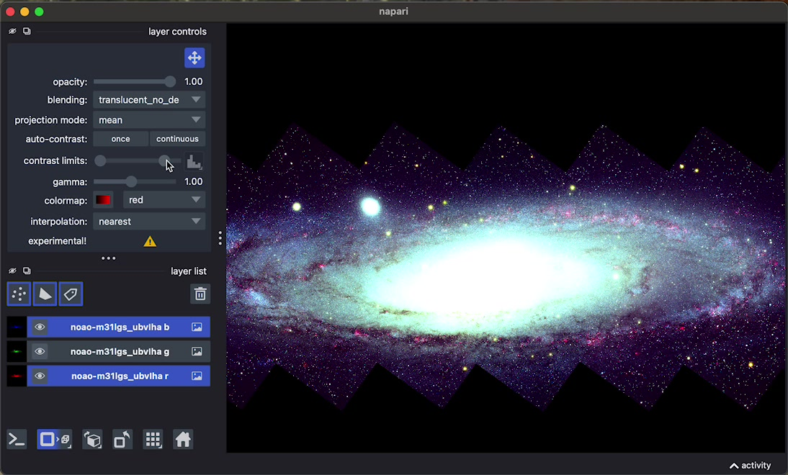
  </video>
  <caption>
    <p>Since napari 0.9.0, you can adjust parameters of multiple layers at
    once.</p>
  </caption>
</figure>
```

### Isolated plugin functions

Curtis Rueden, of [Fiji] fame, and Brian Northan, famous for his deep dives
into user questions on [image.sc], recently joined the napari Steering Council
(about which we feel very lucky!), and joined us also for the hackathon. They
brought their full cross-platform, cross-language, user-centric expertise to
bear, and developed [scikit-ops], a library to define image processing and
analysis functions that run on isolated environments.

[Fiji]: https://fiji.sc/
[image.sc]: https://forum.image.sc/
[scikit-ops]: https://github.com/apposed/scikit-ops

If you use a plugin that defines Ops (roughly: annotated functions describing both
their input and output types, *and* their dependencies, such as TensorFlow
1.15 in Python 3.8), you will never again run into environment conflicts: Ops
use [Appose] to create their own conda environment, then run the function in
that environment *without* copying the array data.

[Appose]: https://github.com/apposed/appose

The really cool thing about Ops is that they can be called from both Python and
Java, so plugin authors can write once and then have their functions usable
from both napari and Fiji!

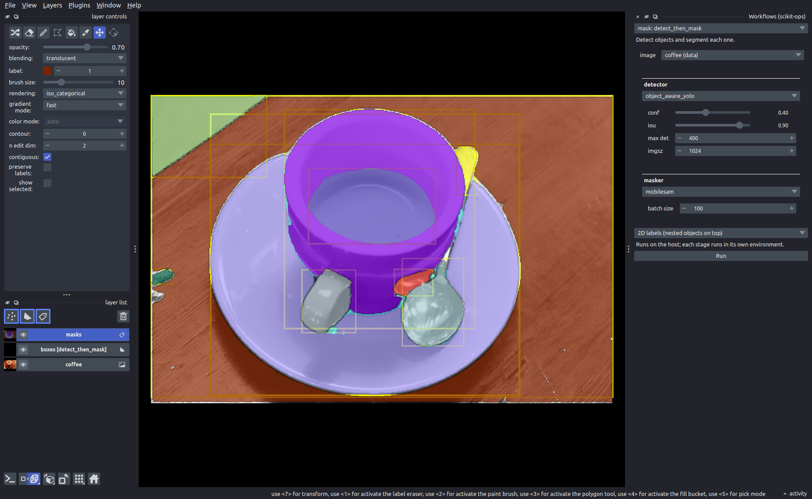

## Individual thoughts

It's really hard to write collectively! So we thought we'd give a space to our
hackathon contributors to share their individual perspectives. We asked
participants for their thoughts on these two questions:

1. What made you decide to attend the hackathon?
2. If you were attending another hackathon soon, what would you want to work
   on?

Their answers below have been lightly edited for length. We hope they inspire
*you*, Dear Reader, to think about why you might come to the next hackathon,
and what you would want to improve in napari when you do!

### Brian Northan

I have been using Napari for a few years now to visualize deconvolution and
segmentation results and to label training data for deep learning. One
complication I face is running different deep learning frameworks (like
Stardist and Cellpose) in the same application or workflow, so I was motivated
to come to the hackathon and work on solutions for this.

I want to work on the napari plugin ecosystem. At the hackathon, we created a
prototype framework to call image analysis functions in isolated environments.
I want to explore how plugins could define environments in the napari plugin
manifest, and map functions to those environments.

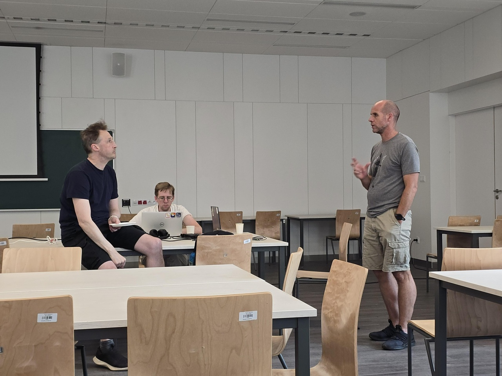

### Jules Vanaret

I thought the hackathon would be a great place to get feedback on contributions
I am interested in, plugins I'm working on, and the future of napari. It was
also a great occasion to learn about good open source practices.

In the future, I'd love to make all non-raster layers (points, shapes,
vectors...) work faster with large datasets, especially Shapes, which I am
using a lot these days.

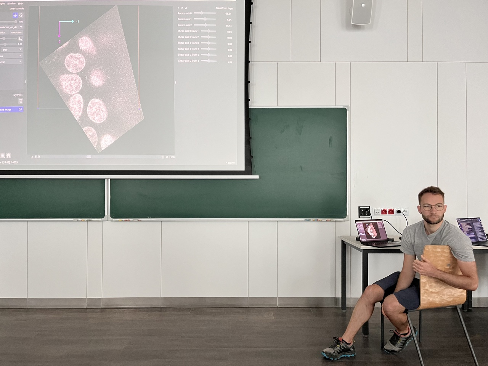

### Zuzana Čočková

I attended the previous hackathon at GloBIAS in Kobe, Japan, which was an
amazing experience. As an image analyst, I use napari regularly in my work, and
I am still curious to learn more about the contributor side rather than only as
a user. Being relatively new to open source contributions, the hackathon is a
great place to learn and gain confidence as a contributor.

I'm interested in continuing to work on [axis-label related topics]. I would
enjoy brainstorming on how napari should handle multiple datasets with
different axis orders or axis labels, and giving users more control over which
dataset axes are mapped to viewer dimension sliders.

[axis-label related topics]: https://github.com/napari/napari/issues/9285

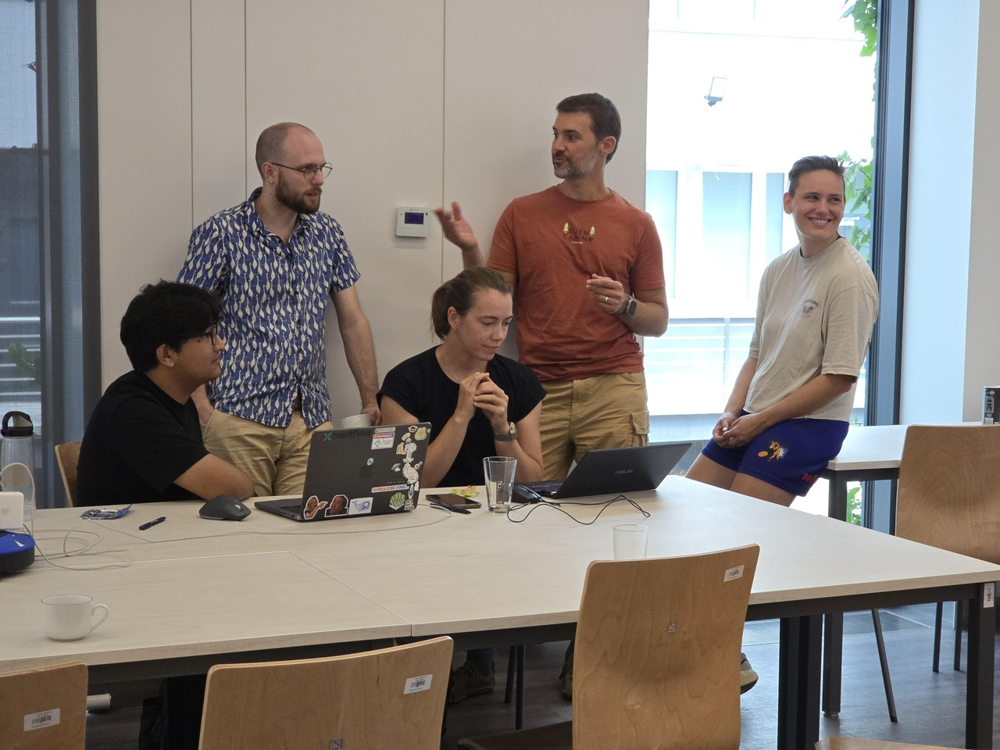

### Margot Chazotte

I wanted to learn more about contributing to napari and there is no better
place for that than at the hackathon. I have been using napari for a long time
now and recently started dipping my toes into contributing. The core team has
been incredibly welcoming and nice so I was super stoked about a chance to meet
them in person and hang out. Also this gave me the chance to add things to
napari that I’ve been wanting as a user!

I’d love to keep working on the dynamic layer controls to help them get out of
experimental mode! They’re a super fun new feature and I’m very proud to have
been a part of making it happen!

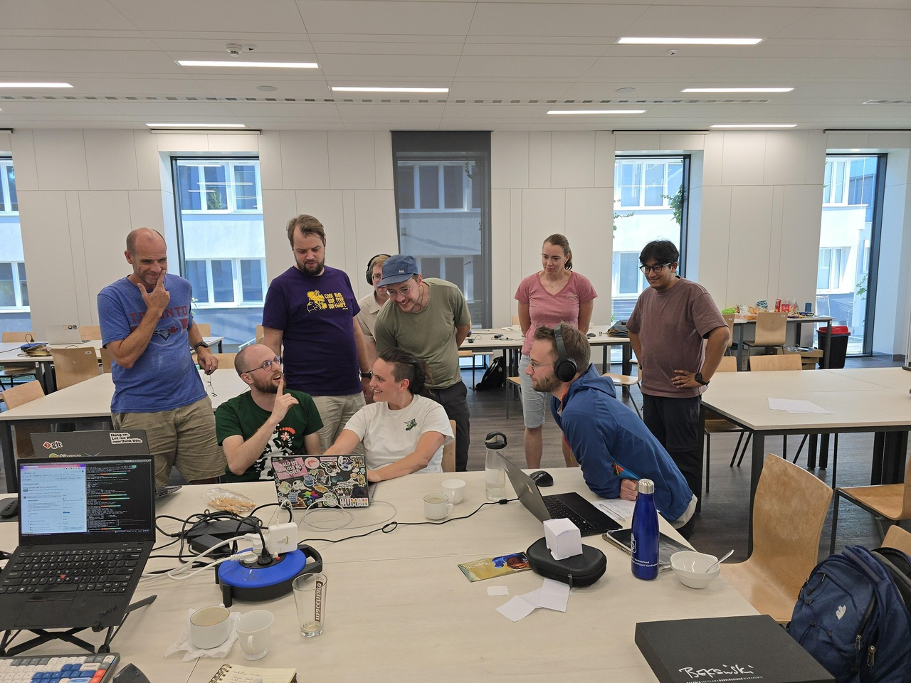

### Giannis Liaskas

I wanted to meet the people behind napari and interact with them. I got a far
better insight of how software development works: I had never worked on such a
big project before and it was fascinating! After attending, I felt far more
comfortable joining [community meetings] and talking in the [group chat]!

It's too early for me to say what I would like to work on next, as the
development of napari is so fast! Certainly, I would like to work again on the
inner machinery of napari though!

[community meetings]: https://napari.org/stable/community/meeting_schedule.html
[group chat]: https://napari.zulipchat.com

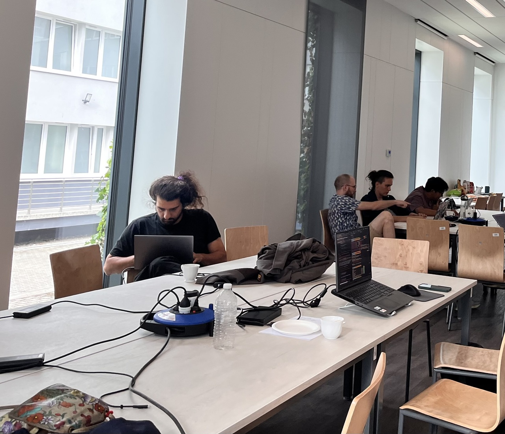

## With thanks

Venue hire, travel for our core team members, and food, snacks and coffee were
funded by CZI's [scaffolding grant] to napari (CZI SVCF grant 2024-355351). We
gratefully acknowledge their support!

[scaffolding grant]: https://napari.org/island-dispatch/blog/roadmap_announcement.html

We also would like to acknowledge the support of the labs and institutions for
our not-yet-core 😉 participants. It's relatively poorly understood that almost
none of the napari core team, and very few of our 200+ contributors, actually
come from a software engineering background. We all have research backgrounds,
in which papers are king and time spent debugging is often considered wasted.
(*Especially* time spent debugging someone else's bug!) But we came together
out of a shared sense of purpose, and even pride, in producing software that
benefits others, and the research enterprise as a whole. And many of us have
stories about a supervisor who thought all this was a waste of time.

So, again, a *huge* Thank You 🙏 to all the PIs and lab directors out there who
Get It, and who support their staff collaborating for the benefit of
all! 🎉

## Looking forward

As mentioned at the start of this post, we're going to keep running these. If
you'd like to be notified of the next one, please get in touch! You can email
us at [info@napari.org], or join our [Zulip chat].  And,
if you would like to host one, please let us know also! We're actively looking
to run local hackathons around the world, and it would take little activation
energy for us to run one at your institution!

[info@napari.org]: mailto:info@napari.org
[Zulip chat]: https://napari.zulipchat.com

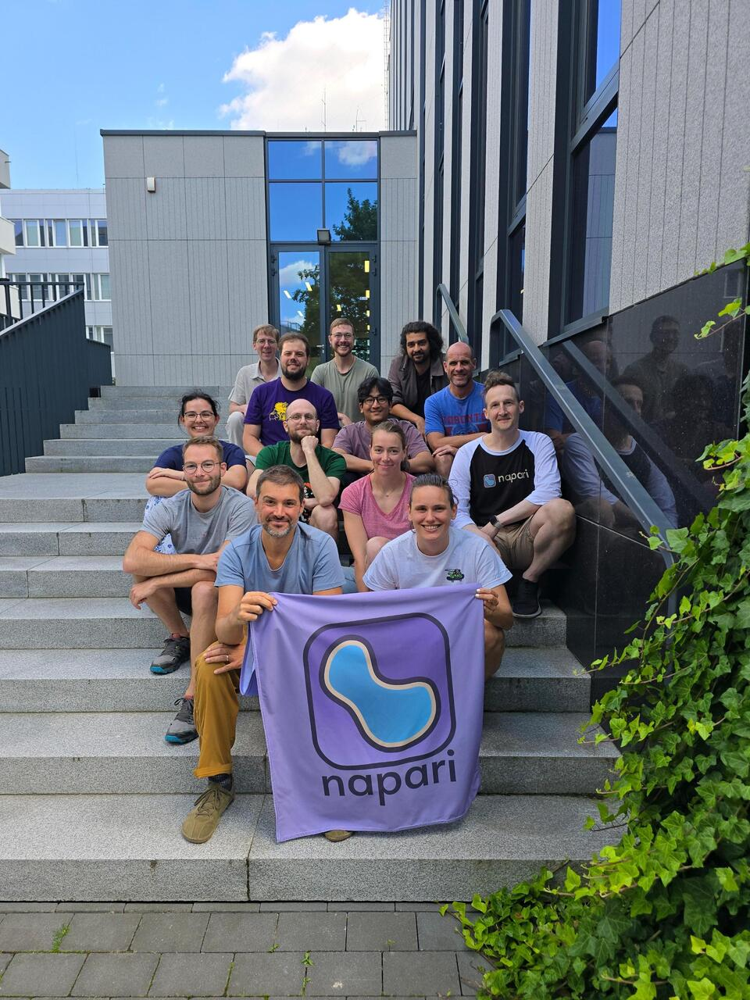

<video width="100%" controls autoplay loop muted playsinline>
  <source src="../_static/naplari-pierogi-logo-transition.webm" type="video/webm">
  <source src="../_static/naplari-pierogi-logo-transition.mp4" type="video/mp4">
  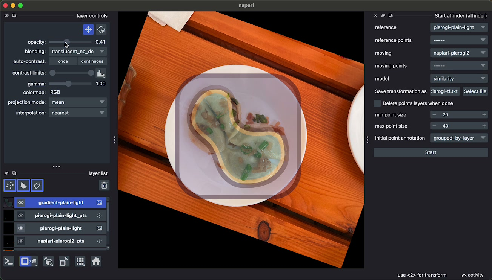
</video>
