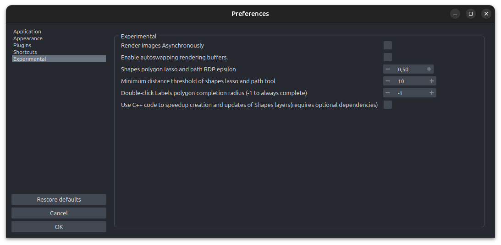

# Triangles Speedup – call for beta testers

We are excited to announce that significant performance improvements are coming to napari Shapes layers.

Shapes layers in napari represent 2D geometric objects, — rectangles, circles,
polygons, paths… — possibly embedded in a higher-dimensional space, for
example, 2D polygons of cell outlines within a 3D image stack.
[Vispy](https://vispy.org), which powers napari's graphics, uses OpenGL to draw
on the screen. The fundamental unit of OpenGL graphics is *triangles*, which
can be put together to draw more complex shapes such as polygons. This means
that we have a preproprocessing step in napari to break down input shapes into
triangles. This step is called *triangulation*.

Until now, we have been using an algorithm called Constrained Delaunay
Triangulation
([1](https://doi.org/10.1007/BF01553881),[2](https://www.cs.jhu.edu/~misha/Spring16/Chew87.pdf)),
implemented in pure Python in Vispy. This has been a performance bottleneck
when creating Shapes layers with thousands to hundreds of thousands of shapes.
(An optional dependency [`triangle`](http://www.cs.cmu.edu/~quake/triangle.html)
can be used to speed things up, but because it uses a proprietary license, we
cannot ship it by default and we cannot use it in the napari bundled app.)

Thanks to the [SpatialData](https://spatialdata.scverse.org/) community, which
decided to sponsor this work, we were able to implement a faster algorithm for
rendering triangles used for rendering geometries in a napari shapes layer.
(`SpatialData` is a framework for the representation of spatial multimodal
data and part of the single-cell omics analysis suite
[scverse](https://scverse.org/).)

We have tested the new implementation on a few example datasets of SpatialData,
and we see a significant speedup. For example, in this [Xenium Human Lung
Cancer dataset from 10x
Genomics](https://www.10xgenomics.com/datasets/preview-data-ffpe-human-lung-cancer-with-xenium-multimodal-cell-segmentation-1-standard)
(available in the SpatialData Zarr format using [these
scripts](https://github.com/giovp/spatialdata-sandbox/tree/main/xenium_2.0.0_io)),
the cell boundaries are stored as 162,000 polygons. When visualizing these
polygons in napari, creation of the shapes layer drops from almost 4 minutes
(napari 0.4.19) to just 20 seconds! (Ubuntu 20.04 with Intel Core i7-8700 CPU @
3.20GHz)
Most of the time creating a Shapes layer with so many shapes was spent on
triangulation, which takes just 2.5s with our changes.

We obtain this dramatic speedup through a combination of algorithmic changes
(using the sweeping line triangulation algorithm from
[3](https://doi.org/10.1007/978-3-540-77974-2)) and code changes —
implementing the algorithm in C++ instead of pure Python.

For now, our fast triangulation is implemented in
`PartSegCore-compiled-backend`, a compiled Python package I was already
distributing for [PartSeg](https://partseg.github.io), which is the main
software output of my PhD and the work that brought me to napari and eventually
the napari core team.
In the near future we plan to create the `bermuda` package (yes, because of the
Bermuda triangle — and with thanks to [Aperio's](https://aperiosoftware.com)
Thomas Robitaille a.k.a. astrofrog for the PyPI package name!), which will
contain fast spatial algorithms for the napari Shapes layer and beyond.
We plan to develop in Rust which [seems to give us even faster
performance](https://github.com/napari/bermuda/pull/1) on top of better memory
safety guarantees. Plus all those shipwrecks are probably pretty rusty!

In the meantime, this is brand-new work and the first foray into compiled code
directly for napari, so we are looking for beta testers. If you use the Shapes
layer, please read on for how you can help, while also benefit from the
increased performance that this work brings!

## How to use it *today*

This feature requires napari in version at least 0.5.6. As of this writing, a
pre-release version of napari 0.5.6 is available on PyPI.

You can install the pre-release using `pip` by specifying a version:

```bash
pip install "napari[optional,pyqt6]>=0.5.6rc0"
```

The "optional" flag ensures that you get the compiled extensions mentioned in
this post.

Since this code is experimental, we have made it opt-in in napari preferences
to enable using it. To enable it, open napari, and open the menu File →
Preferences, then open the Experimental tab and enable the checkbox for "Use
C++ code to speedup creation and updates of Shapes layers".



You can also toggle it using the `COMPILED_TRIANGULATION` environment variable,
for example launching `napari` using the terminal command
`COMPILED_TRIANGULATION=1 napari`, or `COMPILED_TRIANGULATION=1 jupyter lab`
and then using napari within Jupyter.

If you spot any issues (visual or functional), please let us know in our [Zulip
chat room](https://napari.zulipchat.com/), or create an issue on [our GitHub
repo](https:/github.com/napari/napari/issues). You are also welcome to come ask
for help in our [community
meetings](https://napari.org/dev/community/meeting_schedule.html).

## Ongoing work

During testing we observed, that sometimes the algorithm crashes because of [floating point precision](https://learn.microsoft.com/en-us/cpp/build/why-floating-point-numbers-may-lose-precision?view=msvc-170). 
In order to address this we require equivalent, but more floating point precision resistant solutions.

The algorithm will allow us in future to implement support of holes in polygons.

Ths job not (yet) improve code responsible for slownes of editing Shapes layer with a huge number of polygons.

## Acknoledgments

In addition to the SpatialData development team, we would like to express our gratitude to the Chan Zuckerberg Initiative for their generous support, as their funding enabled the SpatialData team to support the work presented here. We also acknowledge the [scverse team](https://scverse.org/), a consortium of open-source developers dedicated to single-cell omics.
